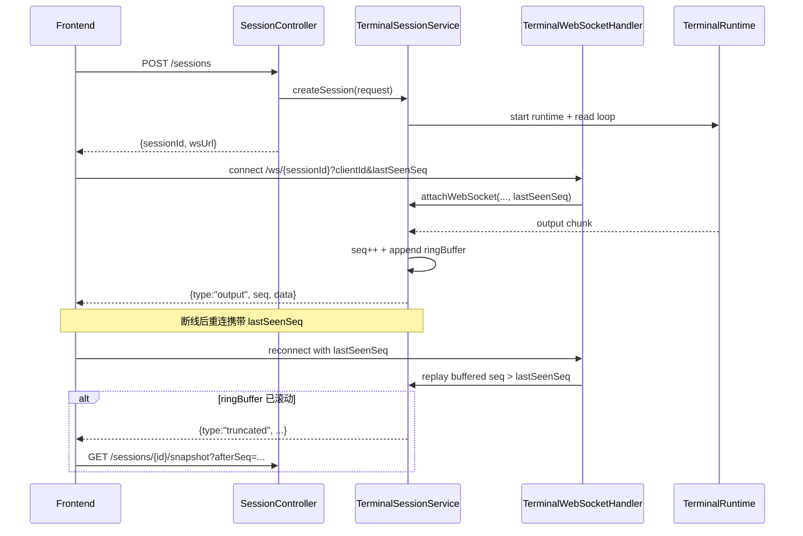
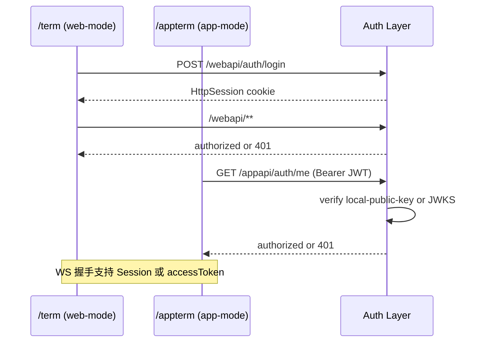
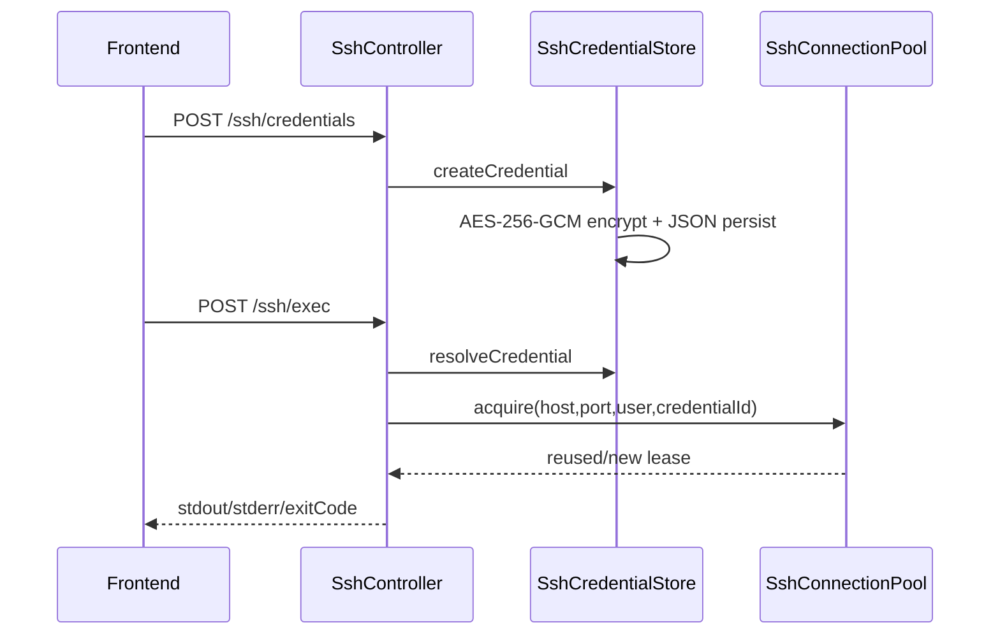
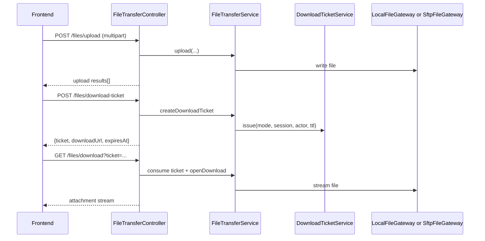

# 核心数据流

## 1) 会话创建 -> WS 连接 -> seq 输出 -> 断线补发

```mermaid
sequenceDiagram
  participant UI as Frontend
  participant API as SessionController
  participant SVC as TerminalSessionService
  participant WS as TerminalWebSocketHandler
  participant RT as TerminalRuntime

  UI->>API: POST /sessions
  API->>SVC: createSession(request)
  SVC->>RT: start runtime + read loop
  API-->>UI: {sessionId, wsUrl}

  UI->>WS: connect /ws/{sessionId}?clientId&lastSeenSeq
  WS->>SVC: attachWebSocket(..., lastSeenSeq)
  RT-->>SVC: output chunk
  SVC->>SVC: seq++ + append ringBuffer
  SVC-->>UI: {type:"output", seq, data}

  Note over UI,SVC: 断线后重连携带 lastSeenSeq
  UI->>WS: reconnect with lastSeenSeq
  WS->>SVC: replay buffered seq > lastSeenSeq
  alt ringBuffer 已滚动
    SVC-->>UI: {type:"truncated", ...}
    UI->>API: GET /sessions/{id}/snapshot?afterSeq=...
  end
```

## 2) Web/App 双认证流

```mermaid
sequenceDiagram
  participant WEB as /term (web-mode)
  participant APP as /appterm (app-mode)
  participant BE as Auth Layer

  WEB->>BE: POST /webapi/auth/login
  BE-->>WEB: HttpSession cookie
  WEB->>BE: /webapi/**
  BE-->>WEB: authorized or 401

  APP->>BE: GET /appapi/auth/me (Bearer JWT)
  BE->>BE: verify local-public-key or JWKS
  BE-->>APP: authorized or 401

  Note over WEB,APP: WS 握手支持 Session 或 accessToken
```

## 3) SSH 凭据加密与连接复用

```mermaid
sequenceDiagram
  participant UI as Frontend
  participant SSHC as SshController
  participant STORE as SshCredentialStore
  participant POOL as SshConnectionPool

  UI->>SSHC: POST /ssh/credentials
  SSHC->>STORE: createCredential
  STORE->>STORE: AES-256-GCM encrypt + JSON persist

  UI->>SSHC: POST /ssh/exec
  SSHC->>STORE: resolveCredential
  SSHC->>POOL: acquire(host,port,user,credentialId)
  POOL-->>SSHC: reused/new lease
  SSHC-->>UI: stdout/stderr/exitCode
```

## 4) 文件上传下载与 ticket

```mermaid
sequenceDiagram
  participant UI as Frontend
  participant FC as FileTransferController
  participant FTS as FileTransferService
  participant TKT as DownloadTicketService
  participant GW as LocalFileGateway or SftpFileGateway

  UI->>FC: POST /files/upload (multipart)
  FC->>FTS: upload(...)
  FTS->>GW: write file
  FC-->>UI: upload results[]

  UI->>FC: POST /files/download-ticket
  FC->>FTS: createDownloadTicket
  FTS->>TKT: issue(mode, session, actor, ttl)
  FC-->>UI: {ticket, downloadUrl, expiresAt}

  UI->>FC: GET /files/download?ticket=...
  FC->>FTS: consume ticket + openDownload
  FTS->>GW: stream file
  FC-->>UI: attachment stream
```
