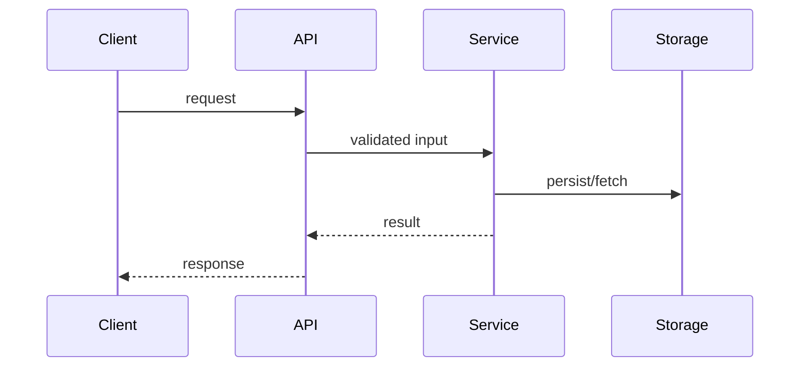
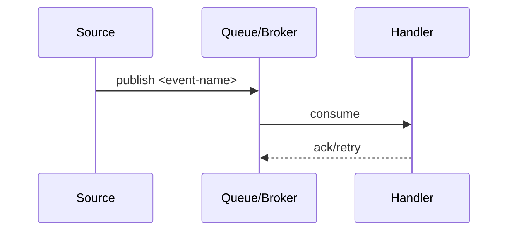

# 核心数据流

## 1. 主链路（`<entry-endpoint>`）

关键事实：
- `<ordering-constraint>`
- `<failure-boundary>`

## 2. 异步链路（`<event-name>`）

## 3. 回放/重试链路
- 触发条件：`<replay-trigger>`
- 数据窗口：`<replay-window-rule>`
- 幂等策略：`<idempotency-rule>`

## [DOC-GAP]
- `[DOC-GAP]` 当异步顺序依赖无法保证时，必须补充补偿策略。
