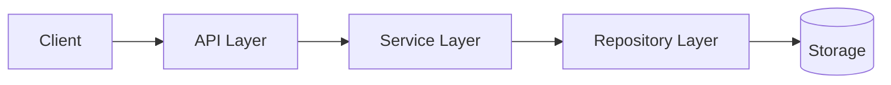

# 系统架构

## 架构模式
- 形态：`<architecture-style>`（示例：modular monolith）
- 通信：`<communication-pattern>`（示例：sync REST + async event）

## 架构图（Mermaid）

## 分层规则
- `Controller -> Service -> Repository`
- 禁止反向依赖。
- 跨模块访问必须经服务层接口。

## 关键约束
- 外部 IO 仅允许出现在 `Repository/Gateway` 层。
- 业务状态机必须落在 `Service` 层。
- 协议层不持有业务持久状态。

## [DOC-GAP]
- `[DOC-GAP]` 若实际架构存在多种通信模式并存，需补充边界图和调用白名单。
